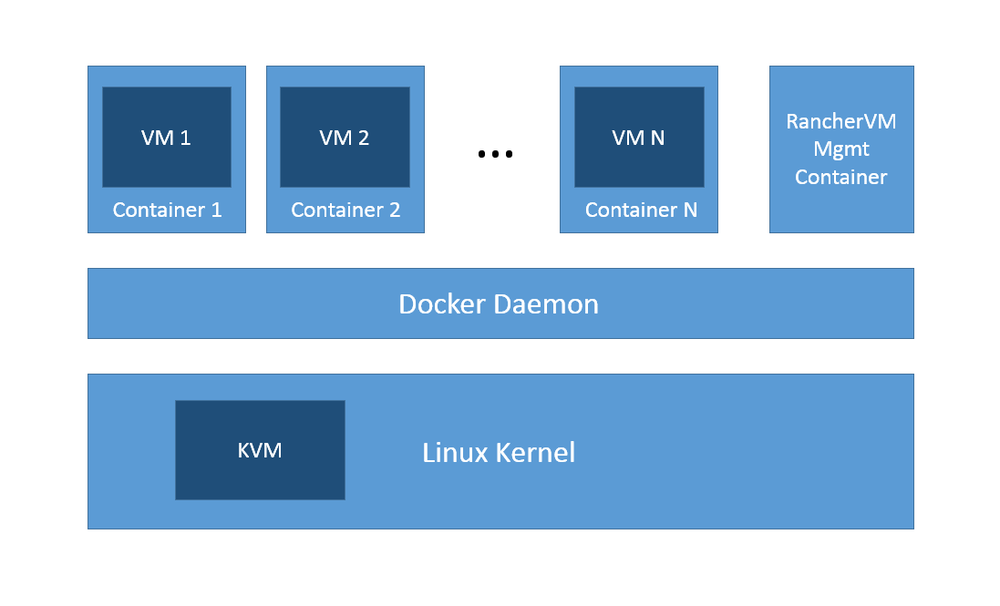

# RancherVM

Package and run KVM images as Docker containers

## How It Works

RancherVM allows you to create a special kind of containers called 
**VM Containers**.  A VM container looks and feels like a regular 
container. It can be created from Dockerfile,
distributed using DockerHub, managed using `docker` command line,
and networked together using links and port bindings. 
Inside each VM container, however, is a virtual machine instance. You can
package any QEMU/KVM image as RancherVM containers.

RancherVM additionally comes with a management container that provides a web
UI for managing virtual machines and accessing the VNC console.

## Run

First, ensure Docker and KVM are both installed on your system. Follow the
distribution-specific instructions to ensure KVM works. We only require
KVM to be enabled in the kernel. We do not need any user space tools
like `qemu-kvm` or `libvirt`. On Ubuntu 14.04, you can make sure KVM is
enabled by checking that both devices `/dev/kvm` and `/dev/net/tun` exist.

You can run RancherVM on RancherOS. If you are running RancherOS 0.3.1 or later, KVM is already enabled in the kernel.

An easy way to run KVM on your Windows or Mac laptop is to use nested
virtualization with VMware Workstation or VMware Fusion. Just enable
"Virtualize Intel VT-x/EPT or AMD-V/RVI" in VM settings.

Once you have Docker and KVM both setup, run:

    docker run -v /var/run:/var/run -p 8080:80 -v /tmp/ranchervm:/ranchervm rancher/ranchervm

and point your browser to `https://<KVM hostname>:8080`

You can create VM containers through the web UI or create them directly
using Docker command line as follows:

    docker run -e "RANCHER_VM=true" --cap-add NET_ADMIN -v \
        /tmp/ranchervm:/ranchervm --device /dev/kvm:/dev/kvm \
        --device /dev/net/tun:/dev/net/tun rancher/vm-rancheros

When you run a VM container from the command line, the system prints a
path to a Unix socket for VNC console access.

Rancher creates 2 IP addresses in the container and that confuses the
RancherVM startup script.
You need to set the environment variable `IP_PREFIX=10.42` to get
RancherVM to work under Rancher.

All the core capabilities of RancherVM reside in the VM container.
The RancherVM management container (`rancher/ranchervm`) provides a 
simple web interface built on
the standard Docker API and is not an essential component of the
system.

## Build VM Images

You can find instructions on how to build images, including Windows 
images, in the [RancherVM Images](docs/images.md) document.

## Networking

The details of how RancherVM configures network for the VM container
is documented in [RancherVM Networking](docs/networking.md).

## Build from Source

Just type `make`

RancherVM uses a modified version of noVNC at `https://github.com/rancherio/noVNC`.
