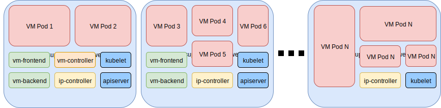

# RancherVM

[Package and run KVM images as Kubernetes pods, run at scale.](https://rancher.com/blog/2018/2018-04-27-ranchervm-now-available-on-kubernetes/)

## How It Works

RancherVM allows you to create VMs that run inside of Kubernetes pods, called
**VM Pods**. A VM pod looks and feels like a regular pod. Inside of each VM
pod, however, is a container running a virtual machine instance. You can
package any QEMU/KVM image as a Docker image, distribute it using any Docker
registry such as DockerHub, and run it on RancherVM.

RancherVM extends the Kubernetes API with [Custom Resource Definitions](https://kubernetes.io/docs/concepts/api-extension/custom-resources/), or CRDs.
Users define a VirtualMachine CRD specification detailing what base image, how
much compute resources and what keypairs are authorized to open an SSH session. 
A Kubernetes controller creates VM pods as necessary to achieve the desired
specification and reflects this in the VirtualMachine CRD status.

RancherVM comes with a Web UI for managing public keys, compute nodes, virtual
machines and accessing the VNC console from a web browser.



## Deployment

### Prerequisite
1. Kubernetes v1.8+
2. KVM has been installed on all nodes.
    1. Follow the distribution-specific instructions to ensure KVM works. We only
require KVM to be enabled in the kernel. We do not need any user space tools
like `qemu-kvm` or `libvirt`. On Ubuntu 16.04, you can make sure KVM is enabled
by checking that both devices `/dev/kvm` and `/dev/net/tun` exist.
    2. An easy way to run KVM on your Windows or Mac laptop is to use nested
virtualization with VMware Workstation or VMware Fusion. Just enable
"Virtualize Intel VT-x/EPT or AMD-V/RVI" in VM settings. Remember to use Ubuntu 18.04 or CentOS with latest kernel in this case, otherwise you will hit bug that VM hanging from [`Booting from harddisk...` ](https://bugs.launchpad.net/qemu/+bug/1636217)
3. All nodes must be in the same layer 2 network, with an existing DHCP server.
4. Host bridge network has been prepared for RancherVM. See [here](https://github.com/rancher/vm/blob/master/docs/networking.md#bridge-to-the-host-network) for details.
    1. Identify your NIC name (e.g. `ens33`) on each host, and replace the value [here](https://github.com/rancher/vm/blob/master/deploy/ranchervm.yaml#L162)
    2. Identify your bridge name (e.g. `br0`) on each host, then replace the value [here](https://github.com/rancher/vm/blob/master/deploy/ranchervm.yaml#L197) and the line below contains `br0`.

Once you have Kubernetes and KVM both setup, and correctly setup the nic names, you can deploy the system:

```
kubectl create -f deploy/ranchervm.yaml
```

When you see all pods are ready and running as follows, you've deployed RancherVM
successfully. Single-node Kubernetes clusters are expected to run fewer pods.

```
$ kubectl -n ranchervm-system get pods
NAME                             READY     STATUS    RESTARTS   AGE
backend-5f5dd7878-5p6rm          1/1       Running   0          1h
frontend-5b5d47c669-cnlwn        1/1       Running   0          1h
ip-controller-648cdf6854-gkvxj   2/2       Running   0          1h
vm-controller-7c5fdbb68d-d8qq8   1/1       Running   0          1h
```

RancherVM is ready to use. To access the UI, discover the endpoint as following.

```
$ kubectl -n ranchervm-system get svc/frontend
NAME       TYPE           CLUSTER-IP    EXTERNAL-IP       PORT(S)        AGE
frontend   LoadBalancer   10.43.55.38   100.200.200.123   80:31520/TCP   42m
```

If the Kubernetes Cluster supports creating LoadBalancer services, access RancherVM UI using the EXTERNAL-IP (100.200.200.123 in the case above) on port 80. Otherwise, access RancherVM UI using <node_ip>:<port> (port is 31520 in the case above), where `node_ip` is the public IP address of any node in the Kubernetes cluster.

Access the UI for most of RancherVM functionalities.

## Build VM Images

You can find instructions on how to build images, including Windows images,
in the [RancherVM Images](docs/images.md) document.

## Networking

The details of how RancherVM configures network for the VM Pod is documented
in [RancherVM Networking](docs/networking.md).

## Build from Source

To build a Docker image, run `IMAGE=yes hack/build.sh`.

To only build the binary for your local OS & ARCH, run `hack/build.sh`.
